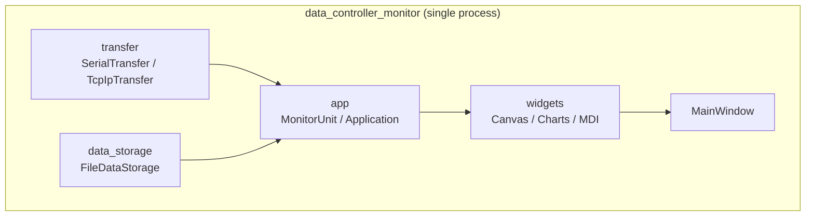
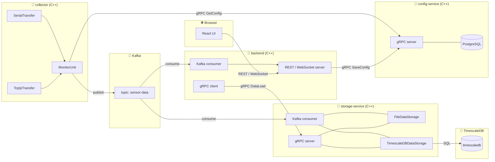
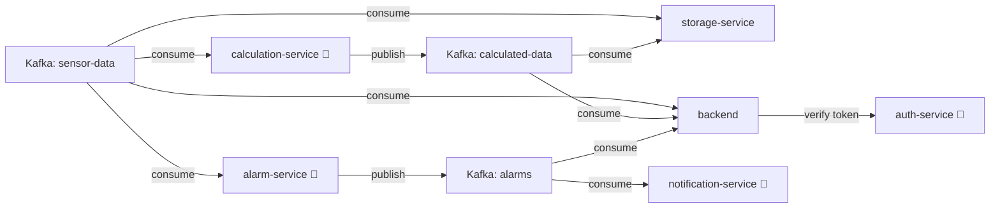

# Architecture

## Current state — monolith

Single process, all layers compiled into one executable.



**Problems:**
- A crash anywhere kills the entire process
- Data collection stops when the UI is closed
- Cannot run collector on a separate machine

---

## Target state — microservices



### Services

| Service | Runtime | Responsibility |
|---------|---------|----------------|
| `collector` | Docker (C++) | `MonitorUnit` + `transfer` — читает конфиг из config-service, собирает данные, публикует в Kafka |
| `Kafka` | Docker | Брокер сообщений — гарантирует доставку, хранит сообщения пока подписчики не прочитают |
| `storage-service` | Docker (C++) | Kafka consumer + gRPC сервер — сохраняет данные в File/TimescaleDB, отдаёт историю по gRPC |
| `TimescaleDB` | Docker | Time-series база данных |
| `config-service` | Docker (C++) | gRPC сервер — хранит настройки collectors (Serial/TCP params), заполняется через backend |
| `PostgreSQL` | Docker | База данных для config-service |
| `backend` | Docker (C++) | Kafka consumer + gRPC клиент — толкает реальное время в React, отдаёт историю и конфиги по REST |
| `web-ui` | Browser (React + TypeScript) | Визуализация в реальном времени, редактор мнемосхем, графики, настройка collectors |

### Почему Kafka решает проблему 99.9% uptime

```
При падении backend:
  collector → Kafka ✅  (данные копятся в топике)
  storage-service   ✅  (продолжает сохранять)
  backend           ❌  (UI недоступен)

При перезапуске backend:
  backend читает накопленные сообщения из Kafka ✅
  данные не потеряны ✅
```

Сбор и сохранение данных **не зависят** от состояния UI.

### collector design

`collector` содержит существующие слои `transfer` + `app`:

```
MonitorUnit  ← MonitorUnitSettings (Serial/TCP params + Kafka broker address)
    ├── SerialTransfer / TcpIpTransfer   ← существующий transfer/
    └── Kafka producer                   ← публикует JSON в топик sensor-data
```

Настройки получаются из config-service по gRPC. Поддерживается hot reload:

```
// При старте — унарный вызов
collector → gRPC GetConfig(collector_id) → config-service

// Постоянный стрим для hot reload
collector → gRPC WatchConfig(collector_id) → config-service
                config-service ──stream──▶ collector  (при каждом изменении конфига)
collector получает новый конфиг → перенастраивает MonitorUnit без перезапуска
```

### storage-service design

```
DataStorageInterface
    ├── FileDataStorage        ← существующий, без изменений
    └── TimescaleDBDataStorage ← новый
```

gRPC API:
- `DataLoad(unit_name, from, to)` — для backend (исторические данные / графики)

---

## gRPC контракты

Определены в [`proto/`](../proto), proto3, по файлу на сервис.

| Файл | Пакет | Служба |
|------|-------|--------|
| [`config_service.proto`](../proto/config_service.proto) | `dcm.config.v1` | `ConfigService` |
| [`storage_service.proto`](../proto/storage_service.proto) | `dcm.storage.v1` | `StorageService` |

Сборка: [`proto/CMakeLists.txt`](../proto/CMakeLists.txt) собирает оба контракта в
статическую библиотеку `dcm_proto`. `protobuf_generate` запускает `protoc` на этапе
сборки — отдельно для сообщений (`*.pb.*`) и для служб (`*.grpc.pb.*`, через
`grpc_cpp_plugin`), результат попадает в каталог сборки. Сервис подключает контракты
двумя строками:

```cmake
add_subdirectory(${CMAKE_CURRENT_SOURCE_DIR}/../../proto ${CMAKE_BINARY_DIR}/proto)
target_link_libraries(<service> PRIVATE dcm_proto)
```

`proto/` лежит выше сервисов, поэтому контекст сборки Docker-образов — корень
репозитория: в `docker-compose.yml` у сервисов `context: .` и явный `dockerfile:`.

### ConfigService

| RPC | Тип | Кто зовёт |
|-----|-----|-----------|
| `GetConfig` | унарный | collector при старте |
| `WatchConfig` | server-streaming | collector, hot reload |
| `SaveConfig` | унарный | backend из UI |
| `ListCollectors` | унарный | backend из UI |
| `DeleteCollector` | унарный | backend из UI |

Решения, заложенные в контракт:

- **Настройки хранения в конфиг не входят.** `collector` только собирает и
  публикует; куда и как сохранять — дело `storage-service`. Это следствие
  выноса `data_storage` из `MonitorUnit`.
- **`TransferSettings` — это `oneof`,** а не набор необязательных полей:
  транспорт всегда ровно один, и контракт не позволяет задать оба сразу.
- **Значения enum'ов совпадают с физическими,** `BAUD_RATE_115200 = 115200`,
  `DATA_BITS_8 = 8`. Приводятся к `QSerialPort::BaudRate` прямым `static_cast`.
  Исключения — `Parity`, `StopBits`, `FlowControl`: у них в Qt нулевое значение
  занято осмысленным вариантом, а в proto3 ноль обязан значить «не задано»,
  поэтому нумерация своя.
- **`version` в `CollectorConfig`** растёт при каждом сохранении. `WatchConfig`
  принимает `known_version`, чтобы не перенастраивать collector зря; `SaveConfig`
  принимает `expected_version` и отвечает `FAILED_PRECONDITION`, если конфиг
  успели изменить из другого места.

### StorageService

| RPC | Тип | Кто зовёт |
|-----|-----|-----------|
| `DataLoad` | server-streaming | backend, история для графиков |
| `ListCollectors` | унарный | backend |

- **`DataLoad` — стрим,** потому что запрошенный диапазон может быть за месяцы;
  складывать его целиком в память не нужно ни серверу, ни клиенту.
- **Тело точки — строка JSON,** ровно та, что опубликовал collector. Схему
  параметров задаёт контроллер, а не мы, поэтому типизировать её нечем.
- **`ListCollectors` здесь и в `ConfigService` — разные списки:** в конфиге
  настроенные collector'ы, в хранилище — реально приславшие данные.

Реальное время в этих контрактах не участвует: backend получает его из Kafka
напрямую, минуя `storage-service`.

---

## Potential future services

Сервисы не включены в текущую реализацию, но типичны для промышленных SCADA-систем.

| Сервис | Ответственность | Взаимодействие |
|--------|----------------|----------------|
| `alarm-service` | Отслеживает пороги параметров, генерирует тревоги, хранит историю тревог, управляет квитированием | Kafka consumer (`sensor-data`) → генерирует тревоги → Kafka topic `alarms` → backend → React UI |
| `notification-service` | Рассылает уведомления (email, SMS, push) при срабатывании тревог | Kafka consumer (`alarms`) → внешние каналы |
| `auth-service` | Аутентификация и авторизация пользователей, ролевая модель (оператор / инженер / администратор) | backend проверяет токены через gRPC перед каждым запросом от React UI |
| `calculation-service` | Вычисляет производные значения из сырых данных (КПД, усреднение, формулы) | Kafka consumer (`sensor-data`) → публикует в Kafka topic `calculated-data` → storage-service, backend |

### Как они вписываются в схему



🔮 — потенциальные сервисы, не входят в текущую реализацию

---

### Stack decisions

| Component | Technology | Status |
|-----------|-----------|--------|
| Frontend | React + TypeScript | ✅ decided |
| Backend modules | C++ | ✅ decided |
| Message broker | Kafka | ✅ decided |
| collector → services | Kafka topic `sensor-data` | ✅ decided |
| backend → frontend | REST + WebSocket | ✅ decided |
| backend → storage (history) | gRPC | ✅ decided |
| Container | Docker | ✅ decided |
| Database | TimescaleDB | ✅ decided |
| gRPC proto contracts | proto3, `ConfigService` + `StorageService` | ✅ decided |
| Canvas editor approach | SVG | ✅ decided |
| collector configuration | Config service + gRPC server-streaming hot reload | ✅ decided |
