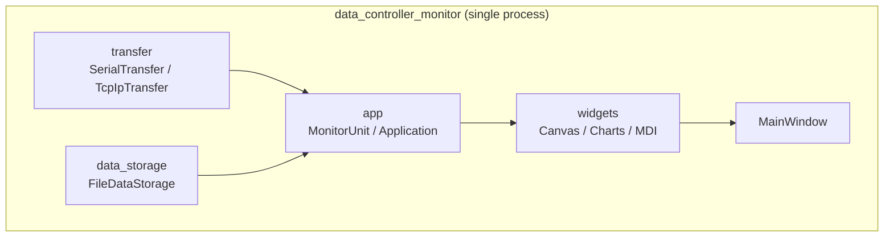
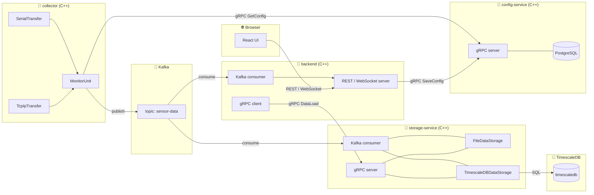
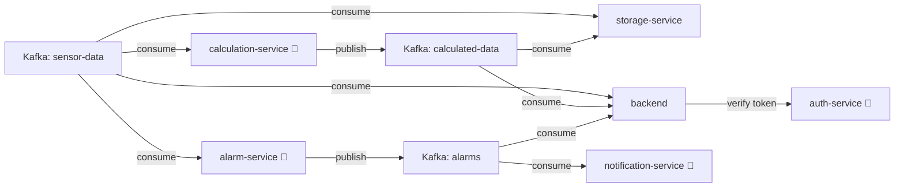

# Architecture

## Current state — monolith

Single process, all layers compiled into one executable.



**Problems:**
- A crash anywhere kills the entire process
- Data collection stops when the UI is closed
- Cannot run collector on a separate machine

---

## Target state — microservices



### Services

| Service | Runtime | Responsibility |
|---------|---------|----------------|
| `collector` | Docker (C++) | `MonitorUnit` + `transfer` — читает конфиг из config-service, собирает данные, публикует в Kafka |
| `Kafka` | Docker | Брокер сообщений — гарантирует доставку, хранит сообщения пока подписчики не прочитают |
| `storage-service` | Docker (C++) | Kafka consumer + gRPC сервер — сохраняет данные в File/TimescaleDB, отдаёт историю по gRPC |
| `TimescaleDB` | Docker | Time-series база данных |
| `config-service` | Docker (C++) | gRPC сервер — хранит настройки collectors (Serial/TCP params), заполняется через backend |
| `PostgreSQL` | Docker | База данных для config-service |
| `backend` | Docker (C++) | Kafka consumer + gRPC клиент — толкает реальное время в React, отдаёт историю и конфиги по REST |
| `web-ui` | Browser (React + TypeScript) | Визуализация в реальном времени, редактор мнемосхем, графики, настройка collectors |

### Почему Kafka решает проблему 99.9% uptime

```
При падении backend:
  collector → Kafka ✅  (данные копятся в топике)
  storage-service   ✅  (продолжает сохранять)
  backend           ❌  (UI недоступен)

При перезапуске backend:
  backend читает накопленные сообщения из Kafka ✅
  данные не потеряны ✅
```

Сбор и сохранение данных **не зависят** от состояния UI.

### collector design

`collector` содержит существующие слои `transfer` + `app`:

```
MonitorUnit  ← MonitorUnitSettings (Serial/TCP params + Kafka broker address)
    ├── SerialTransfer / TcpIpTransfer   ← существующий transfer/
    └── Kafka producer                   ← публикует JSON в топик sensor-data
```

Настройки получаются из config-service по gRPC. Поддерживается hot reload:

```
// При старте — унарный вызов
collector → gRPC GetConfig(collector_id) → config-service

// Постоянный стрим для hot reload
collector → gRPC WatchConfig(collector_id) → config-service
                config-service ──stream──▶ collector  (при каждом изменении конфига)
collector получает новый конфиг → перенастраивает MonitorUnit без перезапуска
```

#### Реализация

Из окружения collector берёт только `COLLECTOR_ID` и `CONFIG_SERVICE_ADDRESS`;
транспорт и настройки Kafka приходят из конфига. Без сохранённого конфига
процесс не падает, а ждёт на стриме и начинает сбор, как только конфиг появится.

| Файл | Ответственность |
|------|-----------------|
| [`config/config_client.cpp`](../services/collector/config/config_client.cpp) | `GetConfig` при старте, затем `WatchConfig` в своём потоке, переподключение |
| [`config/config_mapping.cpp`](../services/collector/config/config_mapping.cpp) | `CollectorConfig` → `MonitorUnitSettings` |
| [`main.cpp`](../services/collector/main.cpp) | применение конфига, пересоздание Kafka producer'а |
| [`tests/config_mapping_test.cpp`](../services/collector/tests/config_mapping_test.cpp) | тесты маппинга, цель `collector_tests` (только Debug) |

- **Стрим живёт в отдельном потоке, а конфиг применяется в потоке Qt.**
  `QTcpServer` и `QSerialPort` принадлежат создавшему их потоку, поэтому конфиг
  переезжает через `QMetaObject::invokeMethod`.
- **Маппинг — единственное место, где встречаются два словаря.** Транспорт
  разбирает настройки строками (`transfer::GetBaudRateFromString` и прочие),
  а контракт оперирует enum'ами; значения `BaudRate` и `DataBits` совпадают с
  физическими, поэтому переводятся числом, остальные три выписаны явно. Тесты
  не сравнивают строки, а скармливают результат самим парсерам транспорта —
  так переименование с любой стороны валит тест, а не collector в проде.
- **Неприменимый конфиг не ломает работающий сбор:** маппинг бросает исключение
  до того, как что-то остановлено, и collector продолжает на прежнем.
- **Неизменившийся транспорт не трогается** — переоткрытие слушающего сокета
  рвёт подключённых контроллеров. Kafka producer пересоздаётся только при смене
  брокера или топика, со сбросом накопленного в старый топик.
- **`known_version` не даёт применить конфиг дважды:** после обрыва стрим
  переоткрывается с уже применённой версией.
- Удаление конфига (`DeleteCollector`) обрывает стрим с `NOT_FOUND`, collector
  продолжает работать на последнем полученном конфиге и ждёт нового.

### storage-service design

```
DataStorageInterface
    ├── FileDataStorage        ← существующий, без изменений
    └── TimescaleDBDataStorage ← новый
```

gRPC API:
- `DataLoad(unit_name, from, to)` — для backend (исторические данные / графики)

---

## gRPC контракты

Определены в [`proto/`](../proto), proto3, по файлу на сервис.

| Файл | Пакет | Служба |
|------|-------|--------|
| [`config_service.proto`](../proto/config_service.proto) | `dcm.config.v1` | `ConfigService` |
| [`storage_service.proto`](../proto/storage_service.proto) | `dcm.storage.v1` | `StorageService` |

Сборка: [`proto/CMakeLists.txt`](../proto/CMakeLists.txt) собирает оба контракта в
статическую библиотеку `dcm_proto`. `protobuf_generate` запускает `protoc` на этапе
сборки — отдельно для сообщений (`*.pb.*`) и для служб (`*.grpc.pb.*`, через
`grpc_cpp_plugin`), результат попадает в каталог сборки. Сервис подключает контракты
двумя строками:

```cmake
add_subdirectory(${CMAKE_CURRENT_SOURCE_DIR}/../../proto ${CMAKE_BINARY_DIR}/proto)
target_link_libraries(<service> PRIVATE dcm_proto)
```

`proto/` лежит выше сервисов, поэтому контекст сборки Docker-образов — корень
репозитория: в `docker-compose.yml` у сервисов `context: .` и явный `dockerfile:`.

### ConfigService

| RPC | Тип | Кто зовёт |
|-----|-----|-----------|
| `GetConfig` | унарный | collector при старте |
| `WatchConfig` | server-streaming | collector, hot reload |
| `SaveConfig` | унарный | backend из UI |
| `ListCollectors` | унарный | backend из UI |
| `DeleteCollector` | унарный | backend из UI |

Решения, заложенные в контракт:

- **Настройки хранения в конфиг не входят.** `collector` только собирает и
  публикует; куда и как сохранять — дело `storage-service`. Это следствие
  выноса `data_storage` из `MonitorUnit`.
- **`TransferSettings` — это `oneof`,** а не набор необязательных полей:
  транспорт всегда ровно один, и контракт не позволяет задать оба сразу.
- **Значения enum'ов совпадают с физическими,** `BAUD_RATE_115200 = 115200`,
  `DATA_BITS_8 = 8`. Приводятся к `QSerialPort::BaudRate` прямым `static_cast`.
  Исключения — `Parity`, `StopBits`, `FlowControl`: у них в Qt нулевое значение
  занято осмысленным вариантом, а в proto3 ноль обязан значить «не задано»,
  поэтому нумерация своя.
- **`version` в `CollectorConfig`** растёт при каждом сохранении. `WatchConfig`
  принимает `known_version`, чтобы не перенастраивать collector зря; `SaveConfig`
  принимает `expected_version` и отвечает `FAILED_PRECONDITION`, если конфиг
  успели изменить из другого места.

#### Реализация

[`services/config-service/`](../services/config-service) — синхронный gRPC-сервер
поверх PostgreSQL. Qt не подключается: переиспользовать из монолита здесь нечего.

| Файл | Ответственность |
|------|-----------------|
| [`storage/config_repository.h`](../services/config-service/storage/config_repository.h) | интерфейс хранилища — SQL не виден слою gRPC |
| [`storage/postgres_config_repository.cpp`](../services/config-service/storage/postgres_config_repository.cpp) | PostgreSQL: схема, версии, реконнект |
| [`service/watch_registry.cpp`](../services/config-service/service/watch_registry.cpp) | подписчики `WatchConfig` |
| [`service/config_service_impl.cpp`](../services/config-service/service/config_service_impl.cpp) | пять RPC, валидация, коды ошибок |

```sql
CREATE TABLE collector_config (
    collector_id TEXT PRIMARY KEY,
    config       JSONB       NOT NULL,
    version      BIGINT      NOT NULL,
    updated_at   TIMESTAMPTZ NOT NULL DEFAULT now()
);
```

- **Конфиг лежит целиком в JSONB, а не разложен по колонкам.** Его схема — это
  сам контракт, раскладку пришлось бы переписывать при каждой правке `.proto`, а
  читается и пишется конфиг всегда целиком. `version` вынесена в отдельную
  колонку: её нужно блокировать и сравнивать, не разбирая JSON.
- **Проверка версии идёт в транзакции.** `SELECT version ... FOR UPDATE` держит
  строку до коммита, поэтому два одновременных `SaveConfig` не могут прочитать
  одну и ту же версию и выставить одну и ту же новую.
- **`WatchConfig` на неизвестный collector не падает,** а держит стрим открытым:
  collector мог стартовать раньше, чем его настроили. Конфиг уедет в стрим сразу
  после первого `SaveConfig`.
- **`DeleteCollector` обрывает стримы** удалённого collector'а с `NOT_FOUND` —
  иначе они бесконечно ждали бы конфиг, которого больше нет.
- **Валидация до сохранения:** пустой `collector_id`, незаданный `oneof transfer`,
  `UNSPECIFIED` в enum'ах Serial, порт вне диапазона, пустые настройки Kafka →
  `INVALID_ARGUMENT`. Отказ должен случиться там, где на него смотрит человек, а
  не в collector'е, где никто не ждёт ответа.
- **Одно соединение с БД под мьютексом.** gRPC обслуживает вызовы пулом потоков, а
  `pqxx::connection` не потокобезопасен; для трафика конфигов пул соединений
  избыточен. Соединение, разорванное перезапуском postgres, переоткрывается, и
  операция повторяется один раз.

Настройки — через окружение: `CONFIG_SERVICE_ADDRESS` (по умолчанию
`0.0.0.0:50051`) и `POSTGRES_DSN`.

### StorageService

| RPC | Тип | Кто зовёт |
|-----|-----|-----------|
| `DataLoad` | server-streaming | backend, история для графиков |
| `ListCollectors` | унарный | backend |

- **`DataLoad` — стрим,** потому что запрошенный диапазон может быть за месяцы;
  складывать его целиком в память не нужно ни серверу, ни клиенту.
- **Тело точки — строка JSON,** ровно та, что опубликовал collector. Схему
  параметров задаёт контроллер, а не мы, поэтому типизировать её нечем.
- **`ListCollectors` здесь и в `ConfigService` — разные списки:** в конфиге
  настроенные collector'ы, в хранилище — реально приславшие данные.

#### Реализация

[`services/storage-service/service/`](../services/storage-service/service) —
gRPC-сервер рядом с Kafka consumer'ом, порт из `STORAGE_SERVICE_ADDRESS`
(по умолчанию `0.0.0.0:50052`, наружу не публикуется).

- **Стрим доходит до хранилища.** `DataStorageInterface::DataLoad` отдаёт точки
  не контейнером, а через `DataSink` — колбэк, возвращающий `false`, чтобы
  прекратить обход. Иначе «не держать месяц в памяти» из контракта нарушалось бы
  на сервере, а `limit` пришлось бы применять уже после чтения всего диапазона.
- **Consumer и сервер живут в разных потоках,** поэтому `StorageRegistry` вынесен
  из `main.cpp` и защищён мьютексом. Сами хранилища — нет: пишущая сторона
  трогает только своё состояние, читающая открывает собственные файлы.
- **Читающая сторона ничего не создаёт.** `FindCollector` возвращает `nullptr`,
  если каталога нет, — иначе `DataLoad` с опечаткой в имени оставлял бы пустой
  каталог, и тот немедленно попадал бы в `ListCollectors`.
- **Дни берутся с диска, а не перебором диапазона:** запрос без нижней границы
  означал бы тысячи промахов по несуществующим файлам.
- **Интервал полуоткрытый `[from, to)`** — как в контракте; отдельный тест
  фиксирует, что точка на `from` попадает в выдачу, а на `to` — нет.

Реальное время в этих контрактах не участвует: backend получает его из Kafka
напрямую, минуя `storage-service`.

---

## Планы

### Убрать Qt из сервисов

Серверные сервисы Qt не нужен: GUI там нет, а `libQt6Core` тянет `libicu` — в
образе collector'а это 7.5 МБ самого Qt плюс 36 МБ icu, итого 166 МБ против
103 МБ у config-service, написанного на std.

Новый код сервисов уже пишется на std (`config-service` целиком, `collector/config/`
— кроме двух строк адаптера в `ToMonitorUnitSettings`). Qt остаётся в слоях,
пришедших из монолита:

| Слой | Состояние |
|------|-----------|
| [`storage-service/`](../services/storage-service) | ✅ Qt убран целиком, образ 157 → 102 МБ |
| [`collector/transfer/`](../services/collector/transfer) | `QTcpServer`/`QTcpSocket` → сокеты + `poll`, `QSerialPort` → `termios`, `QHostAddress` → `inet_pton` |
| [`collector/app/`](../services/collector/app) | `QJsonDocument` → сторонняя JSON-библиотека, `MU_ObserverBase : QObject` → обычный интерфейс |
| [`collector/main.cpp`](../services/collector/main.cpp) | `QCoreApplication` → свой цикл событий на `poll` |
| [`collector/kafka/`](../services/collector/kafka) | `QString` → `std::string`, правка механическая |

Главное осложнение — не объём, а то, что [корневой CMakeLists](../CMakeLists.txt#L18-L23)
компилирует слои сервисов в десктопный монолит, а его виджеты завязаны на те же
классы. Значит, слои разводятся: монолит остаётся на своей Qt-копии, сервис
получает версию на std. Для `data_storage` это уже сделано — копия монолита лежит
в [`data_storage/`](../data_storage) в корне. Это осмысленно ещё и потому, что
монолит по целевой архитектуре замещается `web-ui`.

#### storage-service после выноса Qt

- `DataStorageInterface` больше не шаблон: монолит параметризовал его своими
  Qt-типами, сервису нужна ровно одна пара — сохранить строку JSON, вернуть
  `vector<DataPoint>` с отметками времени.
- **Текстовый формат не изменился** — `HH:MM:SS <json>` построчно, файл на день,
  имя `dd.MM.yyyy.csv`. Файлы, записанные Qt-версией, продолжают дописываться.
- **Двоичный формат изменён**: было представление `QDataStream` (UTF-16 с
  префиксом длины), стало 4 байта длины big-endian + UTF-8 на каждое поле.
  Старые `.dat` этой версией не читаются — их никто, кроме самого сервиса, и не
  читал.
- Первая точка теперь пишется сразу: раньше отсчёт `survey_period` начинался с
  момента создания хранилища, и при периоде в минуту первая минута данных
  терялась.
- `DataLoad` реализован и закрыт тестами (`storage_service_tests`, только Debug),
  хотя вызывать его пока некому — gRPC-сервер `DataLoad` будет следующим.

## Potential future services

Сервисы не включены в текущую реализацию, но типичны для промышленных SCADA-систем.

| Сервис | Ответственность | Взаимодействие |
|--------|----------------|----------------|
| `alarm-service` | Отслеживает пороги параметров, генерирует тревоги, хранит историю тревог, управляет квитированием | Kafka consumer (`sensor-data`) → генерирует тревоги → Kafka topic `alarms` → backend → React UI |
| `notification-service` | Рассылает уведомления (email, SMS, push) при срабатывании тревог | Kafka consumer (`alarms`) → внешние каналы |
| `auth-service` | Аутентификация и авторизация пользователей, ролевая модель (оператор / инженер / администратор) | backend проверяет токены через gRPC перед каждым запросом от React UI |
| `calculation-service` | Вычисляет производные значения из сырых данных (КПД, усреднение, формулы) | Kafka consumer (`sensor-data`) → публикует в Kafka topic `calculated-data` → storage-service, backend |

### Как они вписываются в схему



🔮 — потенциальные сервисы, не входят в текущую реализацию

---

### Stack decisions

| Component | Technology | Status |
|-----------|-----------|--------|
| Frontend | React + TypeScript | ✅ decided |
| Backend modules | C++ | ✅ decided |
| Message broker | Kafka | ✅ decided |
| collector → services | Kafka topic `sensor-data` | ✅ decided |
| backend → frontend | REST + WebSocket | ✅ decided |
| backend → storage (history) | gRPC | ✅ decided |
| Container | Docker | ✅ decided |
| Database | TimescaleDB | ✅ decided |
| gRPC proto contracts | proto3, `ConfigService` + `StorageService` | ✅ decided |
| Canvas editor approach | SVG | ✅ decided |
| collector configuration | Config service + gRPC server-streaming hot reload | ✅ decided |
